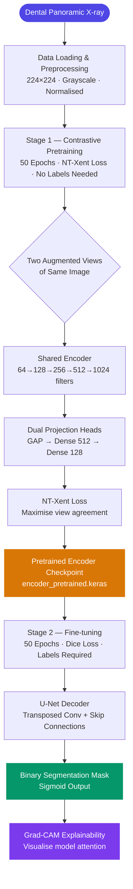
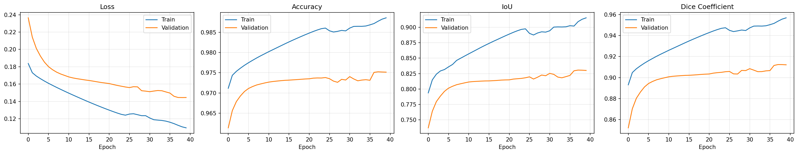

# 🦷 DentoSeg-SSL


> **Self-supervised U-Net segmentation of teeth in dental panoramic radiographs — achieving 90.75% Dice and 82.01% IoU with only 598 labelled images.**

---

## 📌 Table of Contents

- [The Problem](#-the-problem)
- [Our Solution & Purpose](#-our-solution--purpose)
- [Why This Over Others](#-why-this-over-others)
- [Tech Stack](#-tech-stack)
- [System Flow](#-system-flow)
- [File Structure](#-file-structure)
- [Prerequisites](#-prerequisites)
- [Installation & Setup](#-installation--setup)
- [Usage](#-usage)
- [Configuration](#-configuration)
- [Results](#-results)
- [Contribution Guidelines](#-contribution-guidelines)
- [Known Limitations & Roadmap](#-known-limitations--roadmap)
- [License](#-license)

---

## 🚨 The Problem

Accurate tooth segmentation in panoramic X-rays is essential for clinical diagnosis, treatment planning, and orthodontic assessment. Existing fully-supervised deep learning approaches demand large volumes of pixel-level annotated data — a resource that is expensive, time-consuming, and requires expert radiological knowledge to produce.

**Key pain points:**
- Pixel-level mask annotation for panoramic X-rays requires specialist time and is prohibitively costly at scale
- Fully-supervised models trained on small datasets overfit and generalise poorly across different machines and patient demographics
- Existing architectures treat the problem as pure supervised learning, leaving the large pool of unannotated dental images completely unused

---

## 🎯 Our Solution & Purpose

**DentoSeg-SSL** is a two-stage deep learning pipeline that combines self-supervised contrastive pretraining with supervised U-Net fine-tuning, designed for researchers and clinicians who need high-accuracy tooth segmentation without large annotated datasets.

It solves the above by:
1. **Contrastive SSL Pretraining** — A SimCLR-style encoder is pretrained on unlabelled X-rays using NT-Xent loss, learning rich dental representations before seeing a single mask
2. **Encoder Transfer** — The pretrained encoder is transferred into a full U-Net with skip connections; the decoder is warmed up with the encoder frozen, then jointly fine-tuned
3. **Explainability via Grad-CAM** — Gradient-weighted class activation maps are generated for every prediction, making the model's decisions interpretable for clinical review

---

## ⚡ Why This Over Others

| Feature | DentoSeg-SSL | U-Net | Attention U-Net | SegNet |
|---|:---:|:---:|:---:|:---:|
| Self-supervised pretraining | ✅ | ❌ | ❌ | ❌ |
| Works with small labelled datasets | ✅ | ❌ | ❌ | ❌ |
| Skip connections (U-Net decoder) | ✅ | ✅ | ✅ | ❌ |
| Grad-CAM explainability | ✅ | ❌ | ❌ | ❌ |
| Encoder freeze schedule | ✅ | ❌ | ❌ | ❌ |
| Kaggle / Colab / Local notebook | ✅ | ❌ | ❌ | ❌ |
| Open Source | ✅ | ✅ | ✅ | ✅ |

> 💡 **The bottom line:** DentoSeg-SSL is the only approach in this comparison that exploits unannotated dental images during training, directly translating to better generalisation on the supervised task.

---

## 🛠 Tech Stack

### Core ML
| Technology | Version | Purpose |
|---|---|---|
| TensorFlow / Keras | 2.20.0 | Model definition, training, and inference |
| NumPy | ≥1.23 | Numerical array operations |
| scikit-learn | ≥1.2 | Train/test splitting |

### Data & Augmentation
| Technology | Version | Purpose |
|---|---|---|
| OpenCV (headless) | ≥4.7 | Image loading and resizing |
| natsort | ≥8.3 | Natural-order file sorting for paired image/mask loading |

### Visualisation & Logging
| Technology | Version | Purpose |
|---|---|---|
| Matplotlib | ≥3.7 | Training history and result plots |
| tqdm | ≥4.65 | Per-epoch and per-batch progress bars |

### Configuration & Utilities
| Technology | Version | Purpose |
|---|---|---|
| PyYAML | ≥6.0 | YAML config file loading |
| Python | ≥3.10 | Runtime |

### Compute
| Platform | Accelerator | Purpose |
|---|---|---|
| Kaggle Notebooks | 2× Tesla T4 GPU | Primary training environment |
| Google Colab | T4 / A100 GPU | Alternative cloud compute |
| Local | CPU / GPU | Development and inference |

---

## 🔄 System Flow



### Flow Explanation

| Stage | Description |
|---|---|
| **Data Loading** | Images and masks loaded as grayscale, resized to 224×224, normalised to [0,1]. Masks binarised. 80/20 train/test split. |
| **Contrastive Pretraining** | Each X-ray is augmented twice (flip, rotation, noise, contrast) to create two views. The encoder learns to align representations of the same image and separate different images. No mask labels used. |
| **Encoder Transfer** | SSL-trained encoder weights copied into U-Net. Decoder warmed up for 10 epochs (encoder frozen), then jointly fine-tuned at 10× lower learning rate. |
| **Segmentation** | U-Net decoder upsamples bottleneck features through 4 blocks with skip connections, producing a 224×224 sigmoid mask. |
| **Explainability** | Grad-CAM computes gradient-weighted activation maps from the last conv layer, overlaid on the original X-ray for clinical interpretability. |

---

## 📁 File Structure

```
DentoSeg-SSL/
│
├── configs/
│   ├── pretrain.yaml               # SSL pretraining hyperparameters
│   └── finetune.yaml               # Segmentation fine-tuning hyperparameters
│
├── data/
│   ├── __init__.py
│   ├── dataset.py                  # DentalDataset: load, resize, split
│   └── augmentation.py             # RandomContrast layer + augmentation pipeline
│
├── models/
│   ├── __init__.py
│   ├── encoder.py                  # 5-block CNN encoder (64→1024 filters)
│   ├── decoder.py                  # U-Net decoder with skip connections
│   ├── projector.py                # Projection head for contrastive pretraining
│   └── segmentation.py             # Assembled contrastive and segmentation models
│
├── training/
│   ├── __init__.py
│   ├── losses.py                   # NT-Xent loss (corrected) + Dice loss
│   ├── pretrain.py                 # ContrastiveTrainer training loop
│   └── finetune.py                 # Segmentation fine-tuning with freeze schedule
│
├── evaluation/
│   ├── __init__.py
│   ├── metrics.py                  # IoU and Dice coefficient (Keras-compatible)
│   └── visualize.py                # Grad-CAM, result grid, training history plots
│
├── utils/
│   ├── __init__.py
│   ├── env.py                      # Kaggle / Colab / local path auto-detection
│   ├── seed.py                     # Global reproducibility seed
│   ├── config.py                   # YAML config loader
│   └── logging.py                  # Structured logger factory
│
├── scripts/
│   ├── run_pretrain.py             # CLI entry point for pretraining
│   └── run_finetune.py             # CLI entry point for fine-tuning
│
├── notebooks/
│   └── DentoSeg_SSL_Run.ipynb     # Unified notebook (Kaggle / Colab / Local)
│
├── outputs/                        # Generated at runtime — not committed
│   ├── pretrain/
│   │   └── encoder_pretrained.keras
│   └── finetune/
│       ├── best_model.keras
│       └── dental_segmentation_model.keras
│
├── IMAGES/                         # Project images and result visuals
├── requirements.txt
├── .gitignore
└── README.md
```

---

## 🧰 Prerequisites

| Requirement | Minimum Version | Check Command | Download |
|---|---|---|---|
| Python | 3.10 | `python --version` | [python.org](https://python.org) |
| pip | 22.x | `pip --version` | Bundled with Python |
| Git | 2.x | `git --version` | [git-scm.com](https://git-scm.com) |
| CUDA (optional) | 11.8+ | `nvcc --version` | [developer.nvidia.com](https://developer.nvidia.com/cuda-downloads) |

> ⚠️ **OS Compatibility:** Tested on macOS 14+, Ubuntu 22.04+, and Kaggle/Colab Linux environments. GPU training requires a CUDA-compatible NVIDIA card.

---

## 🚀 Installation & Setup

### 1. Clone the Repository

```bash
git clone https://github.com/MNADITYA05/DentoSeg-SSL-Self-Supervised-Dental-Panoramic-Segmentation.git
cd DentoSeg-SSL-Self-Supervised-Dental-Panoramic-Segmentation
```

### 2. Install Dependencies

```bash
pip install -r requirements.txt
```

### 3. Prepare the Dataset

Download the [Children's Dental Panoramic Radiographs Dataset](https://www.kaggle.com/datasets/truthisneverlinear/childrens-dental-panoramic-radiographs-dataset) and place it locally:

```
data/
├── images/    ← panoramic X-ray images
└── masks/     ← binary segmentation masks
```

Or use the notebook on Kaggle — the dataset path is auto-detected with no manual setup required.

### 4. Download Pretrained Weights *(Optional)*

Pre-trained weights are available on the [GitHub Releases page](https://github.com/MNADITYA05/DentoSeg-SSL-Self-Supervised-Dental-Panoramic-Segmentation/releases/tag/v1.0.0):

```bash
# Download best segmentation model
gh release download v1.0.0 --pattern "best_model.keras"

# Download SSL pretrained encoder
gh release download v1.0.0 --pattern "encoder_pretrained.keras"
```

---

## 💡 Usage

### Option A — Kaggle / Colab Notebook (Recommended)

Open `notebooks/DentoSeg_SSL_Run.ipynb`. The notebook auto-detects the environment, installs missing packages, clones the repo, and runs the full pipeline end-to-end.

### Option B — CLI Scripts

**Pretraining only:**
```bash
python scripts/run_pretrain.py --config configs/pretrain.yaml
```

**Fine-tuning only** (requires pretrained encoder):
```bash
python scripts/run_finetune.py --config configs/finetune.yaml
```

**Override paths at runtime:**
```bash
python scripts/run_finetune.py \
  --config configs/finetune.yaml \
  --images /path/to/images \
  --masks  /path/to/masks \
  --encoder outputs/pretrain/encoder_pretrained.keras
```

### Option C — Python API

```python
import tensorflow as tf
from models.encoder import create_encoder
from models.segmentation import create_segmentation_model
from training.losses import dice_loss
from evaluation.metrics import iou_metric, dice_coefficient
from data.augmentation import RandomContrast

# Load trained model
model = tf.keras.models.load_model(
    'outputs/finetune/best_model.keras',
    custom_objects={
        'RandomContrast'   : RandomContrast,
        'dice_loss'        : dice_loss,
        'iou_metric'       : iou_metric,
        'dice_coefficient' : dice_coefficient,
    }
)

# Run inference on a single image (224×224×1, normalised to [0,1])
import numpy as np
image = np.expand_dims(your_image_array, axis=(0, -1))  # (1, 224, 224, 1)
mask  = model.predict(image)                             # (1, 224, 224, 1)
```

### Common Commands

| Command | Description |
|---|---|
| `python scripts/run_pretrain.py` | Run contrastive SSL pretraining |
| `python scripts/run_finetune.py` | Run supervised fine-tuning |
| `jupyter notebook notebooks/DentoSeg_SSL_Run.ipynb` | Launch interactive notebook locally |

---

## ⚙️ Configuration

All hyperparameters live in `configs/pretrain.yaml` and `configs/finetune.yaml`. Key values:

| Parameter | Default | Description |
|---|---|---|
| `data.image_size` | `224` | Spatial resolution images are resized to |
| `training.batch_size` | `16` | Batch size for both stages |
| `training.epochs` | `50` | Training epochs per stage |
| `training.temperature` | `0.1` | NT-Xent softmax temperature |
| `model.projection_dim` | `128` | SSL projection head output dimension |
| `model.freeze_encoder_epochs` | `10` | Epochs to freeze encoder before joint fine-tuning |
| `training.learning_rate` (pretrain) | `3e-4` | Adam LR for contrastive pretraining |
| `training.learning_rate` (finetune) | `1e-4` | Adam LR for segmentation fine-tuning |
| `training.seed` | `42` | Global reproducibility seed |

---

## 📊 Results

### Segmentation Output


### Training History



### Test Set Metrics

| Metric | DentoSeg-SSL |
|---|:---:|
| **Dice Coefficient** | **90.75%** |
| **IoU** | **82.01%** |
| **Accuracy** | **97.39%** |
| **Precision** | **90.05%** |
| **Recall** | **91.47%** |

### SOTA Comparison

DentoSeg-SSL is compared against fully-supervised baselines trained on the same dataset:

| Model | IoU | Dice Coefficient | Accuracy | Recall |
|---|:---:|:---:|:---:|:---:|
| U-Net | 73.9 | 84.2 | 95.1 | 79.4 |
| DeepLab V3+ | 54.6 | — | — | 24.8 |
| Attention U-Net | 79.5 | 88.5 | 95.6 | 85.7 |
| SegNet | 77.1 | 87.1 | 95.1 | 83.3 |
| **DentoSeg-SSL (Ours)** | **82.01** | **90.75** | **97.39** | **91.47** |

DentoSeg-SSL outperforms all fully-supervised baselines across every reported metric, despite being trained on the same 598 labelled images — demonstrating that self-supervised pretraining provides a meaningful representation advantage even on small medical imaging datasets.

---

## 🤝 Contribution Guidelines

We welcome contributions of all kinds — bug fixes, features, docs, and more.

### Getting Started

1. **Fork** the repository
2. **Create** a branch from `main`:
   ```bash
   git checkout -b feat/your-feature-name
   # or
   git checkout -b fix/your-bug-description
   ```
3. **Make** your changes with clear, atomic commits
4. **Push** to your fork and open a Pull Request

### Branch Naming Convention

| Type | Pattern | Example |
|---|---|---|
| New feature | `feat/[short-description]` | `feat/linear-eval-protocol` |
| Bug fix | `fix/[short-description]` | `fix/gradcam-layer-detection` |
| Documentation | `docs/[short-description]` | `docs/update-inference-guide` |
| Refactor | `refactor/[short-description]` | `refactor/augmentation-pipeline` |

### Commit Message Format

Follow [Conventional Commits](https://www.conventionalcommits.org/):

```
feat(models): add EfficientNet encoder option
fix(losses): correct NT-Xent positive pair masking
docs(readme): add SOTA comparison table
```

### Pull Request Checklist

- [ ] Code follows project style
- [ ] All existing imports resolve without error
- [ ] New functionality is documented with docstrings
- [ ] PR description explains *what* and *why*

> 💬 For major changes, open an issue first to discuss the approach.

---

## 🛤 Known Limitations & Roadmap

### Current Limitations

- ⚠️ **Small dataset** — trained on 598 images; performance on out-of-distribution scanners or patient demographics is not yet validated
- ⚠️ **No linear evaluation protocol** — SSL representation quality is not benchmarked independently of the full fine-tuning pipeline
- ⚠️ **Single dataset** — only evaluated on the Adult Tooth Segmentation subset; cross-dataset generalisation is untested
- ⚠️ **Binary segmentation only** — outputs a single tooth-vs-background mask; individual tooth instance segmentation is not supported

### Roadmap

| Status | Milestone | Target |
|:---:|---|---|
| ✅ Done | SimCLR contrastive pretraining | v1.0 |
| ✅ Done | U-Net segmentation fine-tuning | v1.0 |
| ✅ Done | Grad-CAM explainability | v1.0 |
| ✅ Done | Kaggle / Colab / Local notebook | v1.0 |
| ✅ Done | Pretrained weights on GitHub Releases | v1.0 |
| 📋 Planned | Linear evaluation protocol for SSL benchmarking | v1.1 |
| 📋 Planned | Multi-dataset pretraining (all 3 subsets) | v1.1 |
| 📋 Planned | Individual tooth instance segmentation | v2.0 |
| 💡 Exploring | Vision Transformer (ViT) encoder backbone | Future |
| 💡 Exploring | DINO / MAE self-supervised pretraining | Future |

---

## 📄 License

This project is licensed under the **MIT License**.
See the [LICENSE](./LICENSE) file for full details.

---

<div align="center">

Built with ❤️ by [MNADITYA05](https://github.com/MNADITYA05)

[⭐ Star this repo](https://github.com/MNADITYA05/DentoSeg-SSL-Self-Supervised-Dental-Panoramic-Segmentation) · [🐛 Report a Bug](https://github.com/MNADITYA05/DentoSeg-SSL-Self-Supervised-Dental-Panoramic-Segmentation/issues) · [💡 Request a Feature](https://github.com/MNADITYA05/DentoSeg-SSL-Self-Supervised-Dental-Panoramic-Segmentation/issues)

</div>
